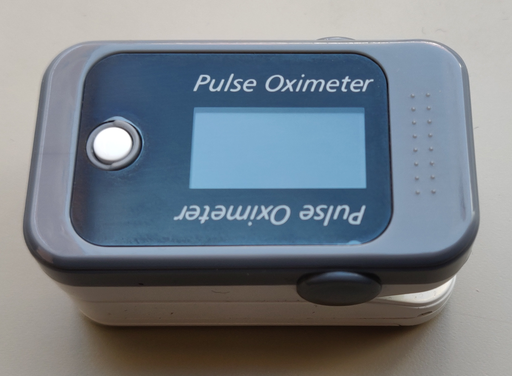
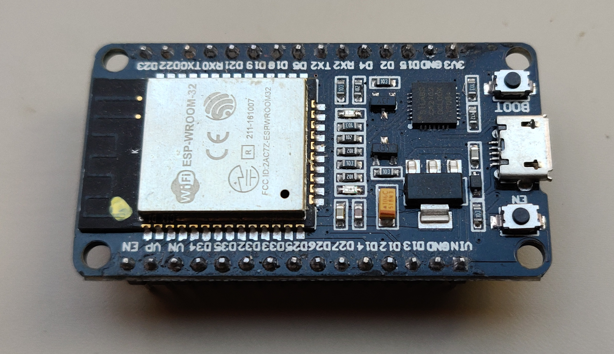
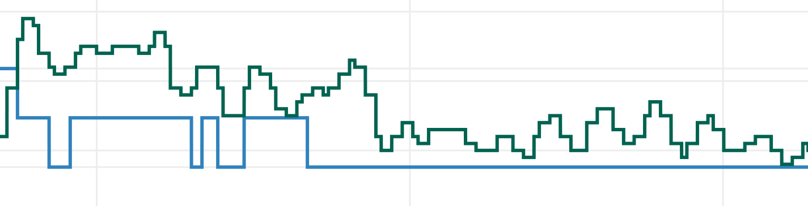

# Oximeter Data Capture and Visualization

This project uses a bluetooth-enabled [pulse oximeter](https://en.wikipedia.org/wiki/Pulse_oximetry#Indication), an ESP32 microcontroller board, and a (Linux) server to capture a longer trace of the heart rate (in beats per minute, BPM), [oxygen saturation level (SpO₂)](https://en.wikipedia.org/wiki/Oxygen_saturation_(medicine)) in percent, and [photoplethysmograph (PPG)](https://en.wikipedia.org/wiki/Photoplethysmogram) values and to visualize them. The intention is to capture a whole night's worth of data, and produce a [PDF with the graphs of the values over time](example-data/oximeter-20200705-145239-83376-test%20trace.pdf).

I developed the project for a BerryMed BM1000C (see below), but with small adjustments it would probably also work for others. The server-based part was tested on Raspberry Pi 4, but there is no reason it should not run on others including earlier Raspberry Pi models (there is not a lot or processing happening on the server) or even on non-Linux machines (e.g., Windows).

The project consists of three parts:
1. The ESP32 sketch: it connects to the oximeter via [bluetooth low energy (BLE)](https://en.wikipedia.org/wiki/Bluetooth_Low_Energy), captures the measured values, and posts the values to an [MQTT](https://en.wikipedia.org/wiki/MQTT) server.
2. A Python script which runs on the server (ideally installed as a service) that subscribes to the relevant MQTT topics and writes the data into a CSV file.
3. A Python script that, once a data recording session is complete, is called with one or more CSV files to visualize the data as graphs and to write the graphs to a PDF.

## Getting Started

This description assumes that you know how to compile and upload sketches to an ESP32 using the [Arduino IDE](https://www.arduino.cc/en/main/software), have some basic understanding of working with the Linux command line, and understand basics about MQTT.

### Prerequisites

Several elements need to be in place for the project to work:
- a bluetooth-low-energy-enabled [pulse oximeter](https://en.wikipedia.org/wiki/Pulse_oximetry); the ESP32 sketch in this project was tested with and is customized for a BerryMed BM1000C:

- an ESP32, for example in the form of a [development board](https://www.espressif.com/en/products/devkits):

- an installed [Arduino IDE](https://www.arduino.cc/en/main/software) with the ESP32 Add-on to compile the ESP32 sketch (should work on all OSes)
- a Linux-based server to manage the data recording, for example a Raspberry Pi running [Raspberry Pi OS/Raspbian](https://www.raspberrypi.org/downloads/raspberry-pi-os/)
- an MQTT server such as [Mosquitto](https://mosquitto.org/) installed on the server (could also be on a different server accessible from the local network); for instance, follow [this tutorial](https://appcodelabs.com/introduction-to-iot-build-an-mqtt-server-using-raspberry-pi)
- a recent Python 3.x installed on the Linux server, along with `pip3` to install further prerequisites
- if the data visualization is not run on the Linux server, also a Python 3.x along with `pip3` installed on the machine to be used for the data visualization (e.g., [for Windows](https://www.python.org/downloads/windows/))
- technically the data recording also could happen on a Windows server, but then the installation process below needs to be adjusted accordingly

### Installing

1. Customize the `ESP32-BLE-Oximeter.ino` file to your oximeter; you need to adjust the following lines with the UUIDs and the address of your device (for an explanation on how to get these values see [the video](https://youtu.be/FIVIPHrAuAI) by [@SensorsIot](https://github.com/SensorsIot) that inspired this project):
```
// The remote service we wish to connect to.
static BLEUUID serviceUUID("49535343-fe7d-4ae5-8fa9-9fafd205e455");
// The characteristic of the remote service we are interested in.
static BLEUUID    charOximeterUUID("49535343-1e4d-4bd9-ba61-23c647249616");
// The address of the target device (needed for connection when the device does not properly advertise services)
static BLEAddress berryMed("00:a0:50:db:83:94");
```

2. Also in the `ESP32-BLE-Oximeter.ino` file, customize the server and MQTT credentials or, alternatively, create a respective `credentials.h` file with the defines of your data (and then uncomment the respective include)
```
// server and MQTT credentials
//#include "credentials.h"
#ifndef WIFI_PASSWORD
#define WIFI_PASSWORD "enter_password"
#endif
#ifndef WIFI_SSID
#define WIFI_SSID     "Some Network"
#endif
#ifndef MQTT_HOST
#define MQTT_HOST     "192.168.1.1"
#endif
#ifndef MQTT_PORT
#define MQTT_PORT     "1883"
#endif
```
Note that this example does not use username and password for the MQTT communication. You should only do it this way if your MQTT server is not accessible from outside your LAN. If you use authentication on your MQTT server, adjust the example accordingly.

3. Again in the `ESP32-BLE-Oximeter.ino` file, customize your time zone to get correct local time stamps by adjusting this line to the Posix TZ string for your time zone, using the respective documentation [here](https://www.di-mgt.com.au/wclock/help/wclo_tzexplain.html) or [here](https://www.di-mgt.com.au/wclock/tz.html):
```
const char* time_zone_string =  "CET-1CEST,M3.5.0/2,M10.5.0/3"; // Posix TZ string for Europe, including DST 
```

4. Compile and upload the sketch to your ESP32, using the `ESP32 Dev Module` board and the `Minimal SPIFFS` partitioning scheme. Assuming that your Linux machine with the MQTT server is running, when the ESP32 starts up it should connect to your network and you should see messages arriving under the topics `sensors/oximeter/#`. You could check for these messages, for example, with [MQTT Explorer](http://mqtt-explorer.com/). When you turn your oximeter on, it should also automatically be recognized, connected to, and the ESP32 should start publishing its data to the topics. You can also use a serial monitor to check that the ESP32 correctly connects to the network and connects to the oximeter.

5. On the Linux server, ensure that the needed Python MQTT module is installed for the data recorder:
```
sudo pip3 install paho-mqtt
```

6. Also on the Linux server, install the `oximeter-data-recording.py` data recorder:
- download or copy the file to a temporary location somewhere, such as to your home directory `~/`, and move the file to `/usr/local/bin/` and make it executable
```
wget https://github.com/tobiasisenberg/OxiVis/raw/master/src/data-recording/oximeter-data-recording.py
cd /usr/local/bin/
sudo mv ~/oximeter-data-recording.py .
sudo chmod 755 /usr/local/bin/oximeter-data-recording.py
```
- in the Python script, edit the address (and, if needed, the port) of the MQTT server as well as the location where you want to store the saved CSV files (the example uses an existing log file directory of an [OpenHAB server](https://www.openhab.org/)).
```
sudo nano /usr/local/bin/oximeter-data-recording.py
```
and change the lines (again note that, if you use MQTT with authentication, you need to adjust the example accordingly)
```
broker_address= "192.168.1.1"       # Broker address
port = 1883                         # Broker port
```
and
```
filenameLocationBasis = "/var/log/openhab2/oximeter-"
```
- test the script
```
/usr/local/bin/oximeter-data-recording.py
```
with the ESP32 running, you should see output such as
```
2020-07-05 14:32:56.838149 Connecting
2020-07-05 14:32:56.844367 Subscribing
2020-07-05 14:32:56.845419 Connected to broker
2020-07-05 14:34:00.059112 Status: Controller connected to MQTT
2020-07-05 14:34:11.446475 Status: Connecting to BLE device 00:a0:50:db:83:94
2020-07-05 14:34:11.652965 Status: Connected to BLE device
2020-07-05 14:34:12.449386 Status: Read value 0x 94 83 db 50 a0 00  
2020-07-05 14:34:12.510560 Status: Connection to BLE device 00:a0:50:db:83:94 completed
2020-07-05 14:34:12.512991 Filename: /var/log/openhab2/oximeter-20200705-143412-15586.csv
2020-07-05 14:34:28.544454 Appending data to file /var/log/openhab2/oximeter-20200705-143412-15586.csv
2020-07-05 14:34:28.580000 Appending data completed after 6000 bytes
2020-07-05 14:34:28.580799 Status: posted to buffer 0
2020-07-05 14:34:43.577773 Appending data to file /var/log/openhab2/oximeter-20200705-143412-15586.csv
2020-07-05 14:34:43.616793 Appending data completed after 6000 bytes
2020-07-05 14:34:43.617551 Status: posted to buffer 1
```
and so on
- setup the Python script to run as a service (other ways than the one shown below are possible, in particular on Linux systems that do not use `systemd`)
```
sudo nano /lib/systemd/system/oximeter-data-recording.service
```
and add the following lines to the new file (adjusting the location of the log file if needed, for example to the same directory where you also store your data files)
```
[Unit]
Description=Record Oximeter Data
After=syslog.target

[Service]
Type=simple
ExecStart=/usr/local/bin/oximeter-data-recording.py
Restart=on-failure
StandardOutput=file:/var/log/openhab2/oximeter-output.log
StandardError=file:/var/log/openhab2/oximeter-output.log

[Install]
WantedBy=default.target
Alias=oximeter-data-recording.service
```
then install, start, and test the service by
```
sudo systemctl enable oximeter-data-recording.service
sudo systemctl start oximeter-data-recording.service
systemctl status oximeter-data-recording.service
```
Now, as long as your ESP32 is running, as soon as you turn on the oximeter you should get the data recorded. This means you should see a CSV file being created in your data recording directory whose name starts with `oximeter-`, in the above example in `/var/log/openhab2/`. Also, the logfile (`/var/log/openhab2/oximeter-output.log` in the example) should start to show messages about data being recorded.

It may happen that the BLE connection or the MQTT connection is interrupted during the data recording, but the ESP32 script should recover automatically, reconnect, and then start a new CSV data file (if the BLE disconnected) or continue the existing recording (if only the MQTT reconnected). In the next step we will combine the data from one or several of these data files from a single session into a joint visualization (explanation below).

7. Data visualization: 
On the system where you want to run the data visualization (can be different from the Linux server), [install Orca (I used the stand-alone binary)](https://github.com/plotly/orca). Then ensure that the respective Python modules are installed (use `sudo` on Linux or an Administrator command line on Windows):
```
pip3 install plotly==4.8.2
pip3 install psutil requests
pip3 install pandas
pip3 install numpy
pip3 install matplotlib
pip3 install PyPDF2
```

8. Visualize your data.
```
oximeter-data-visualization.py "Name extension for the report" oximeter-20200705-143412-15586.csv
```
You can add several additional CSV files from a single recording session (by adding them, separated by a space each, to the call), but these need to be given in the correct sequence and need to use the same millisecond time stamp basis (i.e., need to come from a single session of the ESP32 running continuously, without a reboot). Also note that the data plotting may take a long time, up to an hour or more for several hours worth of data. The reason is that the PDF export from Plotly takes a long time, this is a [known issue](https://community.plotly.com/t/offline-plotting-in-python-is-very-slow-on-big-data-sets/3077). Also ignore the error messages posted at the end of the data visualization such as
```
PdfReadWarning: Multiple definitions in dictionary at byte 0x3ba for key /Type [generic.py:588]
PdfReadWarning: Multiple definitions in dictionary at byte 0x428 for key /Type [generic.py:588]
PdfReadWarning: Multiple definitions in dictionary at byte 0x5a0 for key /Type [generic.py:588]
PdfReadWarning: Multiple definitions in dictionary at byte 0x60e for key /Type [generic.py:588]
PdfReadWarning: Multiple definitions in dictionary at byte 0x41a for key /Type [generic.py:588]
```
and so on. The `example-data` directory contains an [example data file](example-data/oximeter-20200705-145239-83376.csv), a batch file used to process it, and the [resulting PDF report](example-data/oximeter-20200705-145239-83376-test%20trace.pdf).

## Data capture files

The CSV data capture files store the PPG, BPM, and SpO₂ values and a milliseconds timestamp per line (as well as markers for the buffers that were sent over MQTT). Also, the automatically generated filenames of the CSV files indicate the time sync of when the oximeter connected to the ESP32 (both the real time and the millisecond runtime timestamp) so that we can relate the millisecond timestamps to a real data and time. Before processing the data files should thus not be renamed (sure, this could also have been recorded in the data file's first line, but oh well). Several lines have the same milliseconds timestamp because the data values are reported via BLE in bursts, so that several of them have the same (arrival) time. In the visualization later we assume that the data samples were taken at regular, evenly spaced intervals, and we only use the time stamp of the first and last data line in each file to place the data values correctly.

## Several data captures in one session, robustness

As noted above, several data traces may be produced for a single recording sessions due to BLE or MQTT disconnects. This is unfortunate, but we address the issue by visualizing all data together, with some gaps where the traces were interrupted according to the respective time stamps. The ESP32 sketch uses several buffers to ensure that, at least during MQTT reconnects, data continues to be captured and that it is sent once the connection is back.

Currently the ESP32 sketch uses four buffers in total, each containing 15 seconds worth of data (i.e., (3 bytes for PPG, SpO₂, and BPM × 4 data sets per BLE notification + 4 bytes for a milliseconds timestamp) × 25 BLE notifications per second × 15 seconds = 6000 bytes per MQTT message). This means that, at the point when one buffer is full and ready to be sent and MQTT happens to be down right then (or the message sending fails, which also happens occasionally), there is still 3 × 15 seconds = 45 seconds time left for MQTT to reconnect and to send the data, before the first buffer would be overwritten. Nonetheless, both the 15 seconds and the four buffers in total are configurable in the `ESP32-BLE-Oximeter.ino` sketch. In a brief test with a 20 second buffer the MQTT sending failed immediately in my case, but 15 second buffers appear to run stably for me. Feel free to adjust the respective settings at the top of the `ESP32-BLE-Oximeter.ino` sketch to adjust things to your situation.

## Limitations

The data reported by the oximeter via bluethooth low energy (i.e., the PPG, BPM, and SpO₂ values) comes in form of integer values (only one byte each). This is more or less unproblematic for the PPG values because they use much of the value range of the byte (specifically, they go from 0 to 100) and change smoothly and continuously. For the BPM values and, even more, for the SpO₂ values, however, the integer precision leads to clearly visible discrete steps in the visualization:

The problem is worst for the SpO₂ values because they usually only use a fairly small range of only a few integer values. The BPM values vary more but still not as much as the PPG values. The first group of graphs in the visualization that use averaging thus are limited, in particular for the SpO₂ values the discrete steps are still clearly visible. But there is nothing we can do about it due to the rounding (I assume) of these values that happens already on the oximeter, before they are being transmitted via BLE. Unfortunately, the oximeter does not provide access to the raw values.

## Battery use for the oximeter

Judging from my experiments, the oximeter works fine with regular AAA 1.2V NiMH rechargeable batteries, they seem to last for a night's worth of data capture (8 hours, and probably a few hours more). When they are fully charged, I saw 3 out of 4 bars on the battery indicator, and after 8 hours often there was still one bar left. Therefore, it does not seem to be necessary to use Alkaline batteries.

## License

This project is licensed under the GNU General Public License v3.0 - see the [LICENSE](LICENSE) file for details.

## Acknowledgments

The ESP sketch is based on the ESP32 BLE library by [@nkolban](https://github.com/nkolban/) for which I cannot find the source in [the mentioned repository](https://github.com/nkolban/esp32-snippets) (but which is included with the ESP32 Add-on for the Arduino IDE). The BLE example sketch that I used as a starting point apparently was also extended by user [@chegewara](https://github.com/chegewara). The project was inspired by [a video](https://youtu.be/FIVIPHrAuAI) by [@SensorsIot](https://github.com/SensorsIot). I also contributed some initial code to make the BLE-reading of the BerryMed BM1000C working to [@SensorsIot](https://github.com/SensorsIot)'s [repository](https://github.com/SensorsIot/Oximeters-BLE-Hack-ESP32), and this fix is also used in this project.
